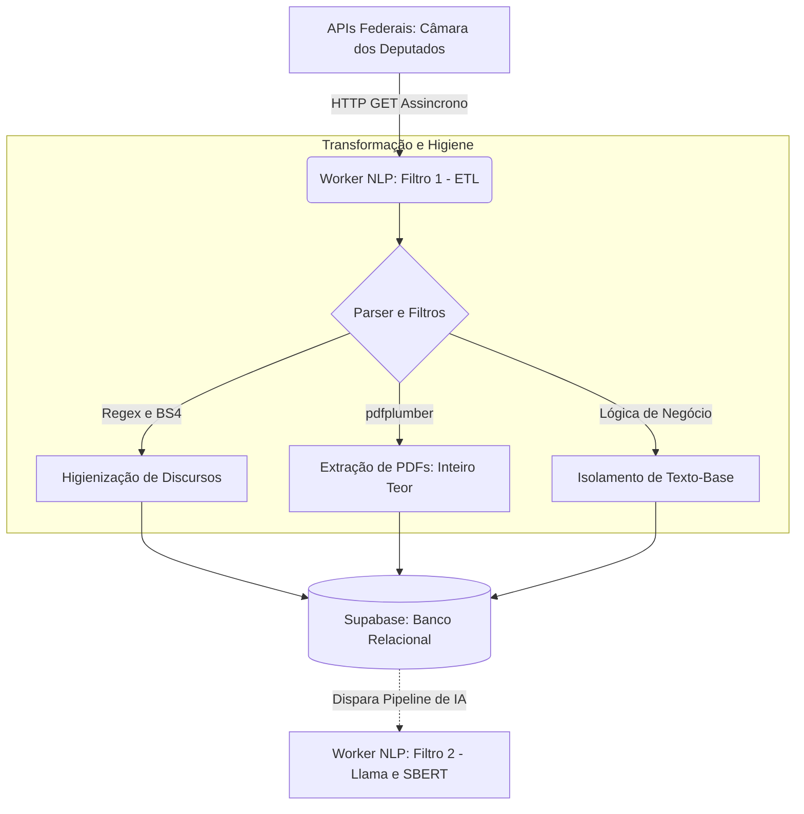

# O Mapa do ETL: Ingestão, Higienização e Carga (Filtro 1)
 
**Responsável:** João Guilherme (@jot4-ge)
 
Este documento detalha a arquitetura da camada de Extração, Transformação e Carga (ETL) do **ContraDito**. Conforme estabelecido na **ADR 002**, este módulo atua como o estágio inicial (**Filtro 1**) dentro do pipeline *Pipe and Filter* do Worker NLP (Lado *Command* / CQRS).
 
O objetivo desta camada é garantir a ingestão robusta de discursos, proposições (Inteiro Teor) e votos nominais, aplicando uma higienização extrema para blindar os modelos de Linguagem (SBERT e Llama 3.1) contra ruídos semânticos e burocráticos.
 
---
 
## 1. Ciclo de Vida do Dado e Arquitetura
 
O dado nasce bruto nos servidores do Governo Federal, é processado, limpo e tem seus PDFs extraídos em um script Python procedural. Após a persistência relacional, os dados ficam à disposição dos próximos filtros do Worker NLP (IA).
 

 
## 2. Escopo e Endpoints Consumidos (MVP)
 
A arquitetura consome a infraestrutura de Dados Abertos da Câmara dos Deputados, com filtros rígidos de escopo (apenas dados da Legislatura 57: 2023 em diante).
 
### Câmara dos Deputados (`/api/v2`)
 
**Perfis Parlamentares:**
 
- `GET /deputados` — Captura de perfis (Titulares e Suplentes) para garantir a integridade de chaves estrangeiras.
**Ideias e Ações (PECs, PLs e Votos):**
 
- `GET /proposicoes?siglaTipo=PEC,PL&ano=2023` — Mapeamento restrito às propostas centrais.
- Leitura de Inteiro Teor: Utilização da biblioteca `pdfplumber` para baixar e ler a URL do documento oficial da proposição em texto plano.
- `GET /votacoes/{id_votacao}/votos` — Mapeamento do posicionamento nominal ("Sim"/"Não").
**Discursos Taquigráficos:**
 
- `GET /deputados/{id}/discursos` — Captura da transcrição bruta das falas em plenário e comissões.
## 3. Estrutura de Dados Normalizada (Supabase)
 
Abandonando o modelo de tabela única, a etapa de ETL agora popula um schema relacional rigoroso, preparando o terreno estruturado para o motor vetorial (pgvector):
 
| Tabela Alvo | Descrição da Carga (ETL) |
|-------------|--------------------------|
| POLITICOS | Tabela primária. Recebe nome, partido, estado e status de mandato. Evita o erro de FK ao contemplar suplentes. |
| PROPOSICOES | Armazena o tipo_proposicao, a ementa curta e o texto integral extraído do PDF da lei. |
| VOTO | Tabela associativa (N:M). Relaciona a ação do parlamentar com o ID da proposição no dia da sessão. |
| DISCURSO | Recebe a massa textual texto_bruto 100% higienizada e a data_discurso. |
 
## 4. Regras de Negócio e Transformação Rigorosa
 
Para que a Busca Semântica via SBERT (Filtro 4) funcione corretamente, o ETL aplica duas camadas de blindagem:
 
### A. Lavanderia de Discursos (Regex e BS4)
 
- **Limpeza Estrutural:** A biblioteca BeautifulSoup remove tags HTML invisíveis.
- **Expressões Regulares (Regex):** Remoção de timestamps, metadados taquigráficos e reações do plenário (`[Risos]`, `(Pausa)`).
- **Jargões e Protocolos:** Exclusão de frases burocráticas não-semânticas (ex: "Sr. Presidente, peço a palavra").
### B. Isolamento de Votações (Antiduplicidade)
 
- **Filtro de Texto-Base:** O script analisa a descrição do objeto da votação no JSON da Câmara.
- São retidas apenas as votações com a terminologia "Texto-base", "Redação Final" ou "1º Turno Substitutivo".
- **Descarte de Ruído:** Emendas supressivas, urgências e destaques são descartados na origem, impedindo que o mesmo parlamentar registre votos divergentes para a mesma Proposição.
## 5. Rotina de Execução (Cron Jobs)
 
O pipeline ETL atua como o gatilho do ecossistema assíncrono do Worker NLP.
 
- **Carga Histórica Inicial (Seeding):** Rodada única para varrer o intervalo de Jan/2023 até o presente momento, criando a fundação relacional.
- **Carga Delta (Rotina Contínua):**
  - Frequência: Semanal.
  - Janela de Execução: Toda sexta-feira, às 03:00 da manhã.
  - Justificativa: As atividades legislativas ocorrem primariamente de terça a quinta-feira. Executar na sexta de madrugada garante que a base extraída e processada pela IA esteja 100% atualizada para o pico de acessos do final de semana na plataforma principal.