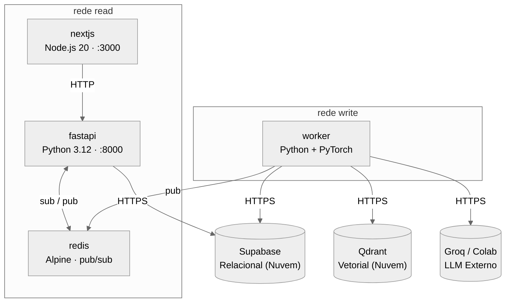

# Manual de Arquitetura Docker — ContraDito

Este documento descreve as decisões arquiteturais que governam a infraestrutura Docker do ContraDito e fornece o guia de execução local.

---

## 1. Visão Geral da Orquestração

A infraestrutura é orquestrada via Docker Compose. Os bancos de dados **não são contêineres** — utilizamos o Supabase (relacional) e o Qdrant (vetorial) como serviços externos em nuvem, e toda persistência de dados e vetores é responsabilidade deles.

Os contêineres locais são exatamente quatro:

| Contêiner | Tecnologia | Porta exposta no host |
|---|---|---|
| `nextjs` | Next.js (Node.js 20) | `3000` |
| `fastapi` | FastAPI (Python 3.12) | `8000` |
| `worker` | Python 3.12 + PyTorch + BAAI/bge-m3 | **Nenhuma** |
| `redis` | Redis Alpine | **Nenhuma** |

O Worker não expõe portas — é disparado por cron job e opera completamente isolado do tráfego web. O Redis também é exclusivamente um canal interno de comunicação assíncrona.

---

## 2. Decisões Arquiteturais Docker

### 2.1 Isolamento de rede obrigatório (CQRS)

O sistema é dividido em dois lados que nunca se comunicam diretamente. Essa separação é garantida pela **topologia de redes Docker**, não apenas por convenção de código. A orquestração define três redes internas:

- **Rede `read`**: conecta `nextjs` ↔ `fastapi` ↔ `redis`.
- **Rede `write`**: conecta `worker` ↔ `redis`. O Worker acessa o Supabase, o Qdrant e o Motor de Inferência via egress HTTPS — não via rede interna Docker.
- O `redis` pertence **a ambas as redes** — é o único ponto de contato entre os dois lados, exclusivamente como canal assíncrono de sinalização.

A `fastapi` **não pertence à rede `write`** e, portanto, não tem rota de rede para o `worker`. Worker e FastAPI nunca se enxergam diretamente — a topologia torna isso impossível.



### 2.2 Bancos de dados externos — sem contêineres locais

Não existe e não deve existir nenhum contêiner Docker para bancos de dados no `docker-compose.yml`. A persistência é responsabilidade exclusiva de dois serviços em nuvem com papéis complementares e bem definidos:

- **Supabase (Relacional):** armazena todos os dados estruturados do domínio. FastAPI e Worker acessam o banco via variáveis de ambiente `SUPABASE_URL` e `SUPABASE_KEY`, por egress HTTPS.
- **Qdrant (Vetorial):** armazena e indexa 100% dos embeddings gerados pelo Worker. O Supabase não possui mais nenhuma responsabilidade vetorial — o pgvector não é utilizado. O Worker acessa o Qdrant via variáveis de ambiente `QDRANT_URL` e `QDRANT_API_KEY`, também por egress HTTPS.

Como ambos os bancos são serviços externos, nenhum volume Docker adicional é necessário para persistência de dados. O comando `docker compose down -v` não representa risco de perda de dados de negócio.

> Para detalhes sobre o Supabase como plataforma e o modelo de persistência relacional, consulte a [Visão Geral da Arquitetura](arquitetura.md).

### 2.3 Motor de Inferência externo — troca de provedor via `.env`

O Motor de Inferência não é um contêiner local. O provedor é selecionado pela variável de ambiente `LLM_PROVIDER`, **sem nenhuma alteração em Dockerfile ou `docker-compose.yml`**.

O Worker acessa o provedor exclusivamente via egress HTTPS a partir da rede `write`.

> Para detalhes sobre os provedores (Groq, Colab/Ollama) e estratégia híbrida, consulte a [Visão Geral da Arquitetura](arquitetura.md).

### 2.4 Volumes — cache HuggingFace

O modelo `BAAI/bge-m3` (~2,3 GB) é baixado automaticamente via HuggingFace na primeira execução do Worker. Para evitar redownload a cada rebuild, os pesos são persistidos em volume Docker:

- Caminho no contêiner: `/root/.cache/huggingface`
- Volume nomeado: `huggingface_cache`

O Redis **não utiliza volume de persistência**. Seu papel é exclusivamente pub/sub de sinalização — não armazena dados de negócio. Se o contêiner reiniciar entre ciclos do Worker, a FastAPI simplesmente não recebe o sinal naquele ciclo e continua servindo o cache atual.

### 2.5 Dockerfile do Worker — layer caching para builds ágeis

O Dockerfile do Worker separa dependências pesadas do código-fonte em camadas distintas (do que muda menos para o que muda mais):

1. Imagem base Python 3.12
2. Dependências de IA: PyTorch, Sentence-Transformers, LangChain
3. Dependências de parsing de PDF
4. Demais dependências Python
5. Código-fonte da aplicação

Isso garante que uma alteração no código da aplicação não invalide as camadas pesadas de IA, que raramente mudam.

### 2.6 Contenção de recursos

O Worker executa NLP intensivo — carrega o modelo de embedding em memória e processa batches. Para não degradar FastAPI e Next.js, **limites de CPU e memória são definidos por contêiner** via `deploy.resources` no `docker-compose.yml`:

```yaml
deploy:
  resources:
    limits:
      cpus: "2.0"
      memory: 4G
```

!!! warning "Apple Silicon"
    Em desenvolvimento local com Apple Silicon, definir esse teto é especialmente importante: sem ele, a vetorização do PyTorch pode consumir todos os núcleos e degradar o ambiente inteiro durante o processamento.

### 2.7 Healthchecks e ordem de inicialização

Como ambos os bancos são externos, não há dependência de inicialização de contêiner de banco. A ordem relevante é:

- `redis` deve subir primeiro — é pré-requisito para `fastapi` e `worker`.
- `fastapi` aguarda o `redis` estar saudável antes de aceitar tráfego.
- `nextjs` aguarda a `fastapi` estar saudável.
- `worker` aguarda o `redis` antes de executar o pipeline.

Uma falha no `worker` não derruba o Lado de Leitura — a FastAPI continua servindo dados do cache.

### 2.8 Invalidação de cache — Redis Pub/Sub

A invalidação do cache em memória da FastAPI ocorre via **Redis Pub/Sub**, preservando o isolamento CQRS:

1. Ao fim de cada ciclo, o Worker persiste os dados no Supabase e os embeddings no Qdrant.
2. O Worker publica uma mensagem em um canal Redis.
3. A FastAPI (subscriber assíncrono) recebe a mensagem e descarta o cache.
4. O próximo request do Next.js recebe dados frescos diretamente do Supabase.

Essa abordagem preserva o isolamento arquitetural sem introduzir chamada HTTP direta entre os dois lados.

### 2.9 Hot-Reload em Desenvolvimento

O ambiente local usa *bind mounts* (volumes mapeados para o host), refletindo instantaneamente modificações no código do Next.js e da FastAPI dentro dos contêineres — sem necessidade de rebuilds contínuos.

---

## 3. Variáveis de Ambiente

As variáveis abaixo afetam diretamente o comportamento dos contêineres:

```env
# Supabase — banco relacional gerenciado (obrigatório para FastAPI e Worker)
SUPABASE_URL=
SUPABASE_KEY=

# Qdrant — banco vetorial gerenciado (obrigatório para Worker)
QDRANT_URL=
QDRANT_API_KEY=

# Motor de Inferência — seletor de provedor (obrigatório para Worker)
LLM_PROVIDER=          # "groq" ou "colab"
GROQ_API_KEY=          # obrigatório quando LLM_PROVIDER=groq
OLLAMA_BASE_URL=       # obrigatório quando LLM_PROVIDER=colab — atualizar a cada sessão

# Redis — canal de invalidação de cache
REDIS_URL=redis://redis:6379

# Front-end
NEXT_PUBLIC_API_URL=http://localhost:8000
```

!!! danger "Atenção"
    `OLLAMA_BASE_URL` não deve ter valor padrão. A ausência do valor quando `LLM_PROVIDER=colab` deve gerar erro explícito no Worker, não falha silenciosa. `REDIS_URL` é consumida pela FastAPI e pelo Worker — ambos devem falhar explicitamente se estiver ausente. `QDRANT_URL` e `QDRANT_API_KEY` são obrigatórias para o Worker — a ausência de qualquer uma deve gerar erro explícito antes de iniciar o pipeline de vetorização.

---

## 4. Guia de Execução Local

!!! warning "Aviso sobre Arquitetura (Apple Silicon / ARM64)"
    Os contêineres, especialmente o `worker`, devem rodar nativamente em `linux/arm64`. Configure `platform: linux/arm64` no `docker-compose.yml` para evitar emulação (Rosetta 2 / amd64), que causa gargalos severos de performance e estouro de memória durante a vetorização.

### Passo 1 — Clonar o repositório

```bash
git clone https://github.com/unb-mds/2026.1-ContraDito.git
cd ContraDito
git checkout develop
```

### Passo 2 — Configurar o `.env`

Crie o arquivo `.env` na raiz conforme a seção 3. Defina ao menos `SUPABASE_URL`, `SUPABASE_KEY`, `QDRANT_URL`, `QDRANT_API_KEY`, `LLM_PROVIDER` e `REDIS_URL`.

### Passo 3 — Subir o ambiente

```bash
docker compose up --build
```

Na primeira execução, o Docker irá:

1. Construir as imagens customizadas (FastAPI e Worker)
2. Baixar as imagens base (Node.js 20, Python 3.12)
3. Instalar as dependências (as camadas de IA do Worker são as mais pesadas)
4. Baixar os pesos do `BAAI/bge-m3` (~2,3 GB) para o volume `huggingface_cache`

A partir da segunda execução, o *Layer Caching* e o volume HuggingFace eliminam esses custos.

Ao final, estarão disponíveis:

- **Interface do usuário:** http://localhost:3000
- **Documentação da API (Swagger):** http://localhost:8000/docs

### Passo 4 — Derrubar o ambiente

```bash
# Derruba os contêineres e remove redes residuais
docker compose down
```

O volume `huggingface_cache` é preservado. Para remover também os volumes:

```bash
docker compose down -v
```

!!! danger "Atenção"
    `down -v` apaga os pesos do modelo. A próxima execução fará o redownload dos ~2,3 GB. Os dados de negócio (Supabase) e os embeddings (Qdrant) **não são afetados** — ambos residem em nuvem, fora do escopo dos volumes Docker.

---

## 5. Executar o Worker Manualmente

O Worker é disparado por cron — não fica em execução contínua. Entre ciclos, o contêiner não existe e não consome memória.

Para executar o pipeline manualmente durante desenvolvimento:

```bash
docker compose run --rm worker python main.py
```

---

## 6. Restrições que Nunca Devem Ser Violadas

| Restrição | Razão |
|---|---|
| FastAPI sem rota de rede para o Motor de Inferência | Isolamento CQRS — garantido por topologia Docker |
| Worker sem rota de rede direta para a FastAPI | Comunicação exclusivamente via Redis |
| Next.js sem acesso direto ao Supabase | Todo acesso ao banco relacional passa pela FastAPI |
| Nenhum contêiner de banco de dados local (PostgreSQL ou Qdrant) | Persistência relacional é o Supabase; persistência vetorial é o Qdrant — ambos em nuvem |
| Qdrant sem volume local | Banco vetorial externo — dados residem na nuvem, fora do escopo Docker |
| Redis sem porta exposta no host | Canal interno — não acessível fora da orquestração |
| Redis sem volume de persistência | Canal de sinalização efêmero |
| Troca de provedor LLM apenas via `.env` | Sem alterações em Dockerfile ou `docker-compose.yml` |
| Responsabilidade vetorial exclusiva do Qdrant | O pgvector (Supabase) não deve ser usado para embeddings — consistência do espaço vetorial |
| Modelo de embedding fixo: `BAAI/bge-m3` | Consistência do espaço vetorial com dados já indexados no Qdrant |
| Worker sem portas expostas no host | Isolamento do processamento pesado |