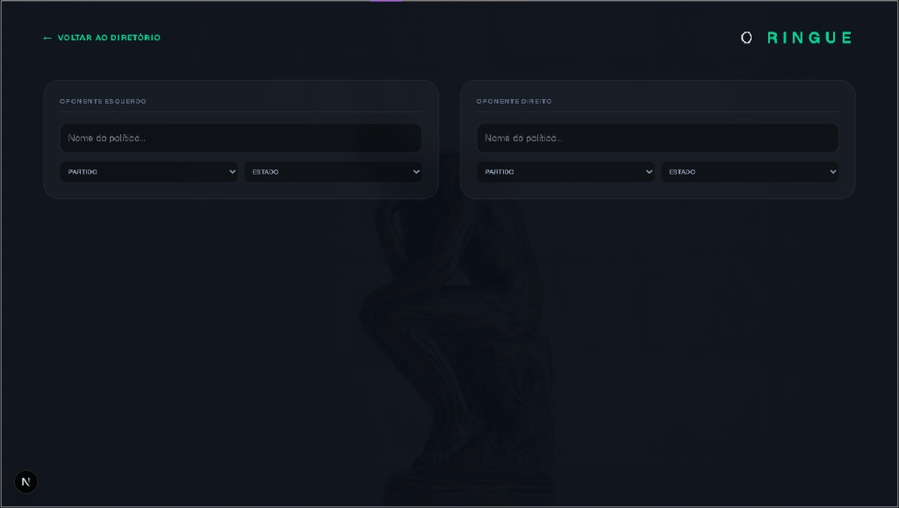

# Protótipos e UI/UX (Figma)

A interface do **ContraDito** foi idealizada seguindo o princípio de **Mobile First**, garantindo que a experiência de fiscalização pública seja fluida, rápida e intuitiva, tanto em smartphones quanto em computadores.

##  O "Ringue" (Comparação Lado a Lado)
Uma das inovações de UX do nosso projeto é a tela de comparação. 
- No **Desktop**, utilizamos um layout de tela dividida (*split screen*) para que o usuário veja dois políticos ao mesmo tempo.
- No **Mobile**, os dados são empilhados de forma inteligente para manter o contexto da comparação sem prejudicar o uso.

##  Protótipos de Alta Fidelidade
Abaixo, apresentamos as telas principais do sistema conforme projetadas no Figma:

### Tela Inicial e Busca
> 

### Comparação (O Ringue)
> 